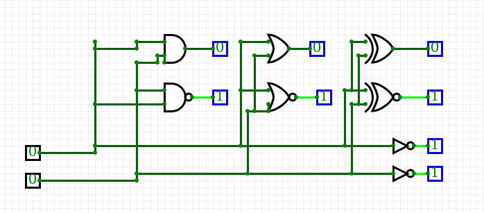
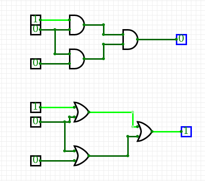

# Digital-electronics-1

#**První cvičení DE1**
_V této hodině se máme seznámit s GiftHubem a udělat si vlastní Readme soubor._
*Ing. Kaderka nám ukáyal, jak vztvořit vlastní repoyitář.*
__Každou větu píši jiným fontem, abzch se naučil yákladz.__
##**Tabulka**

|a|b|OR|AND|
|0|0|0|0|
|0|1|1|0|
|1|0|1|0|
|1|1|1|1|

   | **A** | **NOT** |
   | :-: | :-: |
   | 0 | 1 |
   | 1 | 0 |

   | **A** | **B** | **AND** | **NAND** |
   | :-: | :-: | :-: | :-: |
   | 0 | 0 | 0 | 1 |
   | 0 | 1 |  0| 1 |
   | 1 | 0 |  0|  1|
   | 1 | 1 | 1 |  0|

   | **A** | **B** | **OR** | **NOR** |
   | :-: | :-: | :-: | :-: |
   | 0 | 0 | 0 | 1 |
   | 0 | 1 | 1 | 0 |
   | 1 | 0 | 1 | 0 |
   | 1 | 1 | 1 | 0 |

   | **A** | **B** | **XOR** | **XNOR** |
   | :-: | :-: | :-: | :-: |
   | 0 | 0 | 0 | 1 |
   | 0 | 1 | 1 | 0 |
   | 1 | 0 |1  | 0 |
   | 1 | 1 |0  | 1 |

|

|

